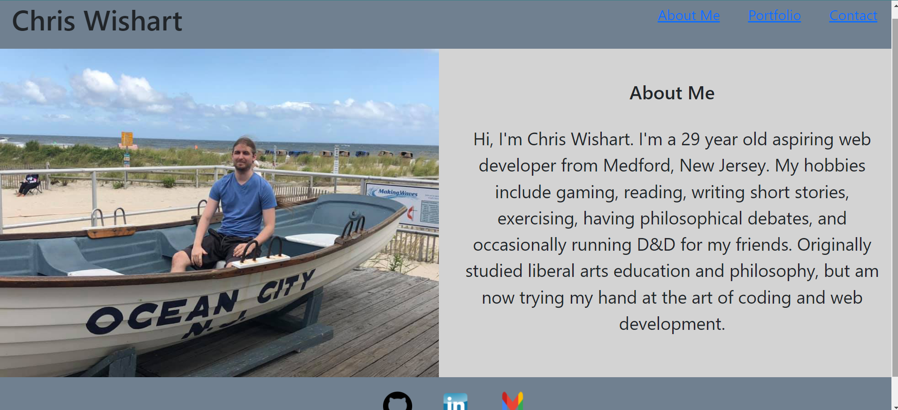

# React-Portfolio

  

  ## Table of Contents
  - [Description](#Description)
  - [Installation](#Installation)
  - [Usage](#Usage)
  - [Tests](#Tests)
  - [License](#License)
  - [Questions](#Questions)
  - [Contributors](#Contributors)

  ## Screenshot
  

  ## Description
  This Portfolio was made using React, and displays information about me, multiple deployed projects of mine, as well as links to my contact infomation.

  ## Installation
  Open in terminal, then type "npm i"

  ## Usage
  Open in terminal, then type "npm start"

  ## Deployment
  https://cwishart203.github.io/React-Portfolio/

  ## Tests
  N/A

  ## License
  
   
  This application uses no license.

  ## Questions
  You can contact me for questions at my [email](mailto:cwishart203@gmail.com), or you can go to my [GitHub](https://github.com/cwishart203).

  ## Contributors
  N/A
